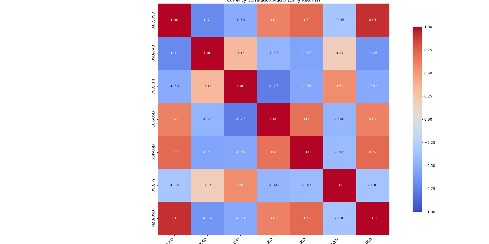

# Financial Data Analysis  

A collection of Python projects exploring quantitative finance, portfolio analytics and financial data analysis using historical market data from Yahoo Finance.

This repository documents my progress as I learn Python for quantitative finance. Each project builds on the previous one, starting with analysing a single stock before moving into portfolio construction, risk analysis, correlation, portfolio rebalancing and eventually portfolio optimisation.
---

# Projects

## 1. Single Stock Analysis (`single_stock_analysis.py`)

Analyses a single stock using historical adjusted closing prices.

### Features

- Total Return
- Compound Annual Growth Rate (CAGR)
- Annualised Volatility
- Best and Worst Trading Day
- Best and Worst Calendar Month
- Historical Price Chart

### Example Output


---

## 2. Multi-Stock Performance Comparison (`compare_stocks.py`)

Compares the historical performance of multiple companies over the same time period.

### Current Portfolio

- NVDA
- AAPL
- MSFT
- GOOGL
- AMZN

### Features

- Downloads historical adjusted prices
- Starting and Ending Prices
- Total Return
- Compound Annual Growth Rate (CAGR)
- Annualised Volatility
- Best and Worst Trading Day
- Best and Worst Calendar Month
- Comparison Table
- Historical Price Comparison Chart

### Example Output


---

## 3. Equal-Weight Portfolio Analysis (`portfolio_analysis.py`)

Builds an equally weighted portfolio using the same five stocks.

The portfolio starts with **$100,000**, allocating **20%** to each holding and rebalancing back to the target weights every trading day.

### Portfolio Metrics

- Daily Portfolio Returns
- Portfolio Growth
- Final Portfolio Value
- Portfolio Profit
- Total Return
- Compound Annual Growth Rate (CAGR)

### Risk Metrics

- Annualised Volatility
- Sharpe Ratio (0% Risk-Free Rate)
- Maximum Drawdown

### Individual Stock Metrics

- Starting and Ending Prices
- Total Return
- CAGR
- Annualised Volatility
- Sharpe Ratio
- Maximum Drawdown

### Reporting

- Portfolio Summary Table
- Individual Stock Comparison Table

### Example Output


---

## 4. Portfolio Rebalancing Comparison (`portfolio_rebalancing.py`)

Compares how different portfolio rebalancing frequencies affect long-term performance, risk, and drawdowns using historical market data.

The portfolio starts with **$100,000** invested equally across:

- NVDA
- AAPL
- MSFT
- GOOGL
- AMZN

The following strategies are compared against the **S&P 500** benchmark:

- Buy and Hold
- Daily Rebalancing
- Monthly Rebalancing
- Quarterly Rebalancing
- Annual Rebalancing
- S&P 500 Benchmark

### Performance Metrics

- Final Portfolio Value
- Total Return
- Compound Annual Growth Rate (CAGR)
- Annualised Volatility
- Sharpe Ratio (0% Risk-Free Rate)
- Sortino Ratio
- Calmar Ratio
- Downside Deviation
- Maximum Drawdown
- Longest Underwater Period
- Peak, Valley and Recovery Dates
- Peak-to-Recovery Duration
- Valley-to-Recovery Duration
- Positive vs Negative Monthly Performance

### Visualisation

The project generates a comparison chart showing:

- Portfolio performance for every strategy
- S&P 500 benchmark performance
- Automatically calculated maximum drawdown period
- Peak, valley and recovery annotations
- Major historical market events for additional context

### Output

- Strategy Comparison Table
- Portfolio Performance Comparison Chart
- Risk and Performance Metrics
- Historical Drawdown Analysis

### Example Output


The maximum drawdown period is calculated automatically from the portfolio data, while major market events are manually annotated to provide historical context for significant portfolio movements.

---

## 5. Currency Correlation Matrix (`correlation_matrix_currency.py`)

Calculates the Pearson correlation between the daily returns of seven major currency pairs and visualises the relationships using a correlation heatmap.

Rather than comparing raw exchange rates, the project converts prices into daily percentage returns before calculating the Pearson correlation coefficient. This provides a more meaningful comparison of how currency pairs move relative to one another.

### Currency Pairs

- EUR/USD
- GBP/USD
- AUD/USD
- NZD/USD
- USD/CAD
- USD/JPY
- USD/CHF

### Features

- Downloads historical exchange-rate data from Yahoo Finance
- Calculates daily percentage returns
- Computes the Pearson correlation matrix
- Visualises the results using a heatmap
- Uses a fixed colour scale from **-1** to **1** for consistent comparisons

### Example Output



# Technologies Used

- Python
- Pandas
- Matplotlib
- Seaborn
- yfinance

---

# Future Improvements

Some ideas I'd like to add as I continue learning:

- Live Rolling Correlation Dashboard
- Covariance Matrix
- Portfolio Beta
- Rolling Volatility
- Rolling Sharpe Ratio
- Monte Carlo Portfolio Simulation
- Modern Portfolio Theory (MPT)
- Efficient Frontier
- Portfolio Optimisation
- CAPM
- Factor Models (Fama-French)

---

# Notes

This repository is mainly a learning project as I develop my Python skills alongside quantitative finance concepts.

The aim isn't to build production-ready software straight away, but to understand the statistics, mathematics and programming behind quantitative finance before gradually improving each project as I learn more.

Each project builds on ideas from previous ones, allowing me to revisit earlier work and improve it as my understanding develops.

---

## Repository Structure

```text
financial-data-analysis/
│
├── images/              # Figures used in the README
├── docs/                # Project notes and future ideas
│
├── single_stock_analysis.py
├── compare_stocks.py
├── portfolio_analysis.py
├── portfolio_rebalancing.py
├── correlation_matrix_currency.py
│
├── README.md
└── LICENSE
```

# Roadmap

- [x] Single Stock Analysis
- [x] Multi-Stock Comparison
- [x] Portfolio Analysis
- [x] Portfolio Rebalancing
- [x] Currency Correlation Matrix
- [ ] Covariance Matrix
- [ ] Monte Carlo Simulation
- [ ] Efficient Frontier
- [ ] Portfolio Optimisation
- [ ] CAPM
- [ ] Factor Models