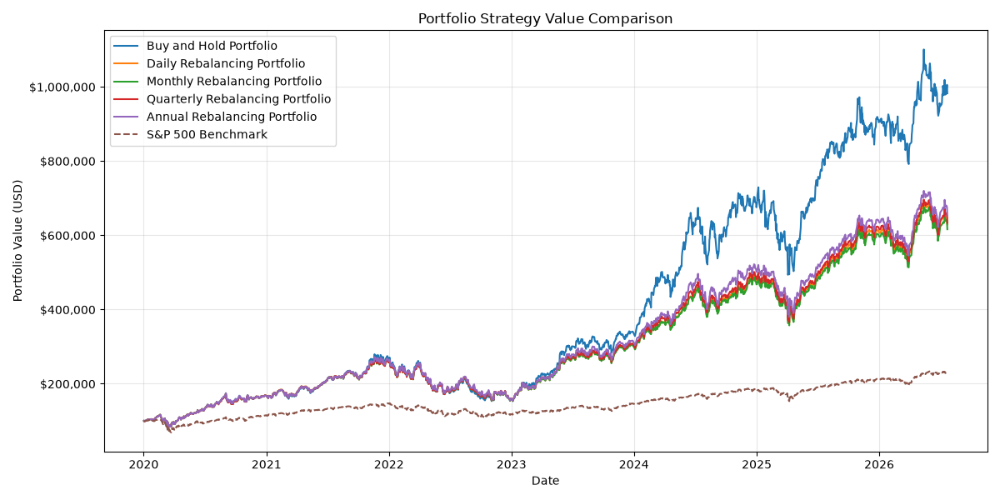

# Stock Market Analysis

A collection of Python projects exploring quantitative finance, portfolio analytics and financial data analysis using historical market data from Yahoo Finance.

This repository documents my progress as I learn Python for quantitative finance. Each project builds on the previous one, starting with analysing a single stock before moving into portfolio construction, risk metrics and portfolio rebalancing.

---

# Projects

## 1. Single Stock Analysis (`single_stock_analysis.py`)

Analyses a single stock using historical adjusted closing prices.

### Features

- Total Return
- Compound Annual Growth Rate (CAGR)
- Annualised Volatility
- Best and Worst Trading Day
- Best and Worst Calendar Month
- Historical Price Chart

### Example Output

---

## 2. Multi-Stock Performance Comparison (`compare_stocks.py`)

Compares the historical performance of multiple companies over the same time period.

### Current Portfolio

- NVDA
- AAPL
- MSFT
- GOOGL
- AMZN

### Features

- Downloads historical adjusted prices
- Starting and Ending Prices
- Total Return
- Compound Annual Growth Rate (CAGR)
- Annualised Volatility
- Best and Worst Trading Day
- Best and Worst Calendar Month
- Comparison Table
- Historical Price Comparison Chart

### Example Output

---

## 3. Equal-Weight Portfolio Analysis (`portfolio_analysis.py`)

Builds an equally weighted portfolio using the same five stocks.

The portfolio starts with **$100,000**, allocating **20%** to each holding and rebalancing back to the target weights every trading day.

### Portfolio Metrics

- Daily Portfolio Returns
- Portfolio Growth
- Final Portfolio Value
- Portfolio Profit
- Total Return
- Compound Annual Growth Rate (CAGR)

### Risk Metrics

- Annualised Volatility
- Sharpe Ratio (0% Risk-Free Rate)
- Maximum Drawdown

### Individual Stock Metrics

- Starting and Ending Prices
- Total Return
- CAGR
- Annualised Volatility
- Sharpe Ratio
- Maximum Drawdown

### Reporting

- Portfolio Summary Table
- Individual Stock Comparison Table

### Example Output

---

## 4. Portfolio Rebalancing Comparison (`portfolio_rebalancing.py`)

Compares how different rebalancing frequencies affect portfolio performance over time.

The portfolio starts with **$100,000** invested equally across:

- NVDA
- AAPL
- MSFT
- GOOGL
- AMZN

The following strategies are compared against the **S&P 500** benchmark:

- Buy and Hold
- Daily Rebalancing
- Monthly Rebalancing
- Quarterly Rebalancing
- Annual Rebalancing
- S&P 500 Benchmark

### Performance Metrics

- Final Portfolio Value
- Total Return
- Compound Annual Growth Rate (CAGR)
- Annualised Volatility
- Sharpe Ratio (0% Risk-Free Rate)
- Maximum Drawdown

### Output

- Strategy Comparison Table
- Portfolio Value Comparison Chart
- Performance Comparison Against the S&P 500

### Example Output

---

# Technologies Used

- Python
- Pandas
- Matplotlib
- yfinance

---

# Future Improvements

Some ideas I'd like to add as I continue learning:

- Portfolio Beta
- Correlation Matrix
- Covariance Matrix
- Rolling Volatility
- Rolling Sharpe Ratio
- Monte Carlo Portfolio Simulation
- Modern Portfolio Theory (MPT)
- Efficient Frontier
- Portfolio Optimisation
- CAPM
- Factor Models (Fama-French)

---

# Notes

This repository is mainly a learning project as I develop my Python skills alongside quantitative finance concepts.

The aim isn't to build production-ready software straight away, but to understand how portfolio statistics, risk measures and investment strategies work before gradually improving and refactoring the code as I learn more.

---

# Roadmap

- [x] Single Stock Analysis
- [x] Multi-Stock Comparison
- [x] Portfolio Analysis
- [x] Portfolio Rebalancing
- [ ] Correlation Matrix
- [ ] Covariance Matrix
- [ ] Monte Carlo Simulation
- [ ] Efficient Frontier
- [ ] Portfolio Optimisation
- [ ] CAPM
- [ ] Factor Models