# Financial Data Analysis

A collection of Python projects exploring quantitative finance, portfolio analytics and financial data analysis using historical market data from Yahoo Finance.

This repository documents my progress as I learn Python for quantitative finance. Each project builds on the previous one, beginning with single-stock analysis before progressing into portfolio construction, performance attribution, risk analysis, correlation modelling, interactive financial dashboards, Monte Carlo portfolio simulation and, eventually, portfolio optimisation.

# Projects

## 1. Single Stock Analysis (`single_stock_analysis.py`)

Analyses a single stock using historical adjusted closing prices.

### Features

- Total Return
- Compound Annual Growth Rate (CAGR)
- Annualised Volatility
- Best and Worst Trading Day
- Best and Worst Calendar Month
- Historical Price Chart

### Example Output

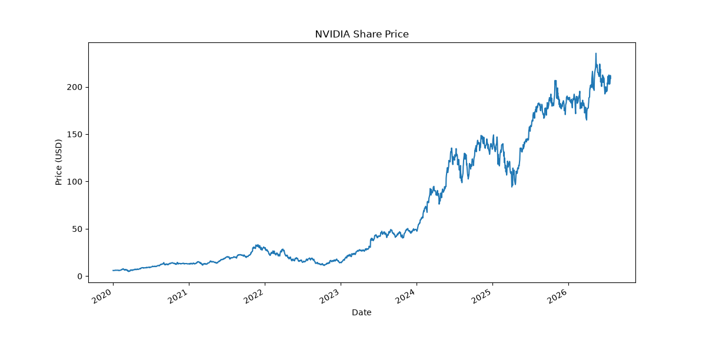

---

## 2. Multi-Stock Performance Comparison (`compare_stocks.py`)

Compares the historical performance of multiple companies over the same time period.

### Current Portfolio

- NVDA
- AAPL
- MSFT
- GOOGL
- AMZN

### Features

- Downloads historical adjusted prices
- Starting and Ending Prices
- Total Return
- Compound Annual Growth Rate (CAGR)
- Annualised Volatility
- Best and Worst Trading Day
- Best and Worst Calendar Month
- Comparison Table
- Historical Price Comparison Chart

### Example Output

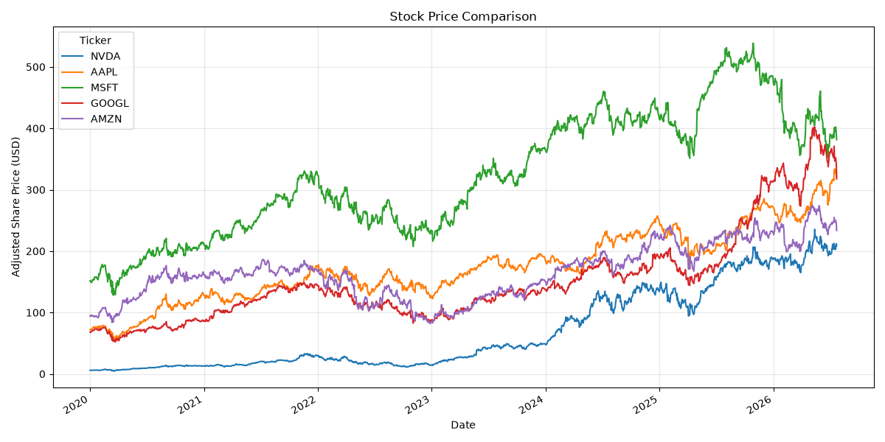

---

## 3. Equal-Weight Portfolio Analysis (`portfolio_analysis.py`)

Builds an equally weighted portfolio using the same five stocks.

The portfolio starts with $100,000, allocating 20% to each holding. Portfolio returns are calculated using constant 20% target weights, effectively representing a daily-rebalanced equal-weight portfolio.

### Portfolio Metrics

- Daily Portfolio Returns
- Portfolio Growth
- Final Portfolio Value
- Portfolio Profit
- Total Return
- Compound Annual Growth Rate (CAGR)

### Risk Metrics

- Annualised Volatility
- Sharpe Ratio (0% Risk-Free Rate)
- Maximum Drawdown

### Individual Stock Metrics

- Starting and Ending Prices
- Total Return
- CAGR
- Annualised Volatility
- Sharpe Ratio
- Maximum Drawdown

### Reporting

- Portfolio Summary Table
- Individual Stock Comparison Table

### Example Output

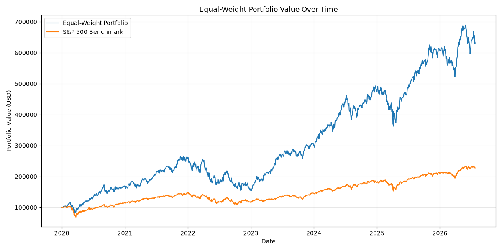

---

## 4. Portfolio Rebalancing Comparison (`portfolio_rebalancing.py`)

Compares how different portfolio rebalancing frequencies affect long-term performance, risk, and drawdowns using historical market data.

The portfolio starts with **$100,000** invested equally across:

- NVDA
- AAPL
- MSFT
- GOOGL
- AMZN

The following strategies are compared against the **S&P 500** benchmark:

- Buy and Hold
- Daily Rebalancing
- Monthly Rebalancing
- Quarterly Rebalancing
- Annual Rebalancing
- S&P 500 Benchmark

### Performance Metrics

- Final Portfolio Value
- Total Return
- Compound Annual Growth Rate (CAGR)
- Annualised Volatility
- Sharpe Ratio (0% Risk-Free Rate)
- Sortino Ratio
- Calmar Ratio
- Downside Deviation
- Maximum Drawdown
- Longest Underwater Period
- Peak, Valley and Recovery Dates
- Peak-to-Recovery Duration
- Valley-to-Recovery Duration
- Positive vs Negative Monthly Performance

### Visualisation

The project generates a comparison chart showing:

- Portfolio performance for every strategy
- S&P 500 benchmark performance
- Automatically calculated maximum drawdown period
- Peak, valley and recovery annotations
- Major historical market events for additional context

### Strategy Definitions

- **Buy and Hold** – The initial equal-weight allocation is purchased once and then left unchanged for the remainder of the investment period.

- **Daily Rebalancing** – Portfolio weights are restored to equal allocations at the end of every trading day.

- **Monthly Rebalancing** – Portfolio weights are restored to equal allocations once per month.

- **Quarterly Rebalancing** – Portfolio weights are restored to equal allocations every three months.

- **Annual Rebalancing** – Portfolio weights are restored to equal allocations once per year.

### Output

- Strategy Comparison Table
- Portfolio Performance Comparison Chart
- Risk and Performance Metrics
- Historical Drawdown Analysis

### Example Output

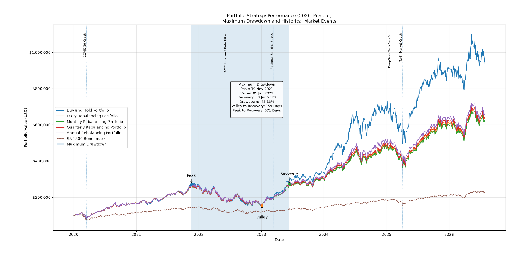

The maximum drawdown period is calculated automatically from the portfolio data, while major market events are manually annotated to provide historical context for significant portfolio movements.

### Observations

Over the historical period analysed, the Buy-and-Hold strategy substantially outperformed the rebalanced strategies. Strong-performing positions, particularly NVIDIA, were allowed to grow into larger portfolio weights over time, meaning the portfolio captured more of their subsequent gains instead of repeatedly trimming them back to equal weights.

By contrast, the rebalancing strategies periodically sold outperforming holdings and reinvested into relatively weaker performers to restore equal allocations. This reduced concentration risk and maintained the intended portfolio allocation, but during this particular period it also reduced exposure to the strongest-performing stocks.

---

## 5. Currency Correlation Matrix (`correlation_matrix_currency.py`)

Calculates the Pearson correlation between the daily returns of seven major currency pairs and visualises the relationships using a correlation heatmap.

Rather than comparing raw exchange rates, the project converts prices into daily percentage returns before calculating the Pearson correlation coefficient. This provides a more meaningful comparison of how currency pairs move relative to one another.

### Currency Pairs

- EUR/USD
- GBP/USD
- AUD/USD
- NZD/USD
- USD/CAD
- USD/JPY
- USD/CHF

### Features

- Downloads historical exchange-rate data from Yahoo Finance
- Calculates daily percentage returns
- Computes the Pearson correlation matrix
- Visualises the results using a heatmap
- Uses a fixed colour scale from **-1** to **1** for consistent comparisons

### Example Output

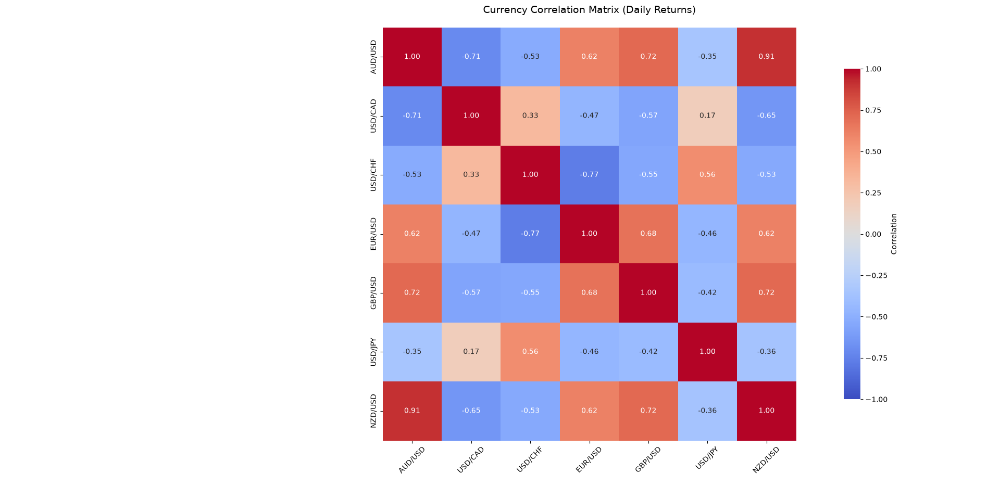

---

## 5.5. Rolling Correlation Dashboard (`rolling_correlation_analysis.py`)

Extends the previous currency correlation matrix by calculating rolling 60-day Pearson correlation matrices, allowing changing relationships between major foreign exchange currency pairs to be explored through time.

Rather than displaying a single static correlation matrix, the dashboard recalculates correlations using a moving rolling window. An interactive slider allows any available trading date to be selected, making it easier to identify how market relationships strengthen, weaken or reverse during different market environments.

### Currency Pairs

- EUR/USD
- GBP/USD
- AUD/USD
- NZD/USD
- USD/CAD
- USD/JPY
- USD/CHF

### Features

- Rolling 60-Day Pearson Correlation Matrix
- Interactive Date Slider
- Dynamic Correlation Heatmap
- Strongest Positive Currency Pair
- Strongest Negative Currency Pair
- Average Correlation
- Average Absolute Correlation
- Correlation Regime Classification
- Largest Correlation Change Between Rolling Windows
- Previous vs Current Correlation Comparison
- Interactive Summary Dashboard

### Example Output

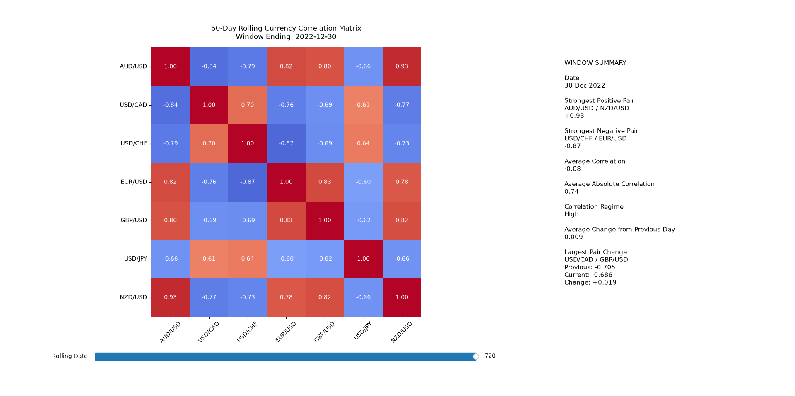

### Interactive Demonstration


---

## 6. Stock Covariance Matrix (`covariance_matrix_stocks.py`)

Calculates and visualises the covariance structure of ten technology and growth stocks using historical daily returns.

Unlike correlation, covariance takes both the direction of the relationship and the size of each stock's movements into account. This makes the covariance matrix an important input when calculating portfolio variance, volatility and risk contributions.

### Stocks Analysed

- Apple
- Microsoft
- Amazon
- Alphabet
- Meta
- NVIDIA
- Tesla
- AMD
- Intel
- Palantir

### Features

- Downloads historical closing prices from Yahoo Finance
- Calculates daily percentage returns
- Computes the daily covariance matrix
- Converts daily covariance into annualised covariance
- Extracts unique stock pairs using the upper triangle of the matrix
- Identifies the highest covariance pair
- Identifies the lowest covariance pair
- Calculates average covariance
- Identifies the highest-variance stock
- Identifies the lowest-variance stock
- Displays an annualised covariance heatmap
- Includes a summary panel beside the heatmap

### Financial Interpretation

Correlation measures the strength and direction of a relationship on a standardised scale from **-1** to **1**. Covariance also measures whether assets move together, but its value is affected by the size of their return movements.

A high covariance can therefore result from two stocks being closely related, highly volatile, or both. The diagonal of the covariance matrix contains each stock's individual variance, while the off-diagonal values describe the joint movement between different stocks.

The annualised covariance matrix produced in this project is used in later projects to calculate portfolio variance, portfolio volatility and asset-level risk contributions.

### Example Output

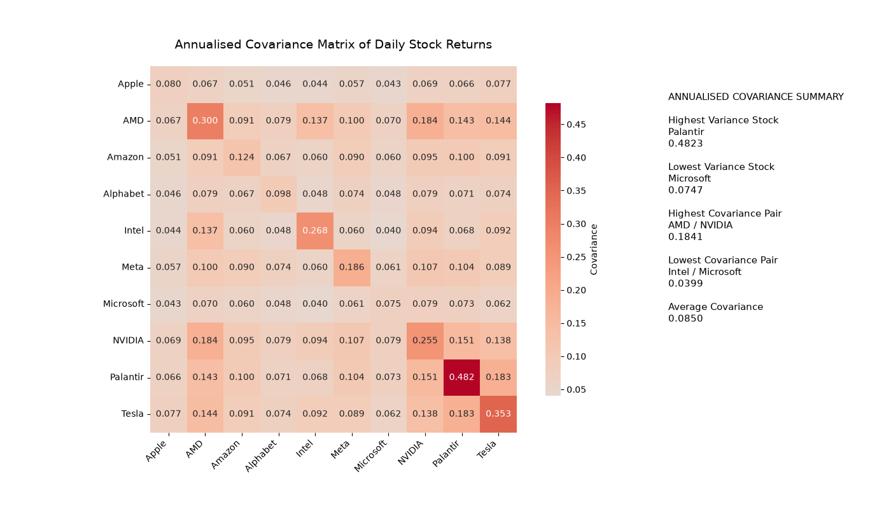

---

## 7. Portfolio Variance and Risk Contribution (`portfolio_variance.py`)

Calculates the overall risk of an equally weighted stock portfolio and identifies how much each holding contributes to that total portfolio risk.

Building on the covariance matrix from the previous project, this analysis applies Modern Portfolio Theory to calculate portfolio variance, portfolio volatility and asset-level risk contributions. Although every stock begins with the same portfolio weight, their contribution to overall portfolio risk differs because of differences in volatility and covariance with the other holdings.

### Portfolio

- Apple
- Microsoft
- Amazon
- Alphabet
- NVIDIA

Each stock is allocated an equal portfolio weight of **20%**.

### Features

- Downloads historical adjusted closing prices from Yahoo Finance
- Calculates daily percentage returns
- Computes daily and annualised covariance matrices
- Calculates portfolio variance using two independent methods
- Calculates annualised portfolio volatility
- Computes marginal risk contributions
- Computes component risk contributions
- Calculates percentage risk contributions
- Produces a formatted portfolio risk table
- Visualises percentage risk contributions with a colour-coded bar chart

### Financial Interpretation

Equal portfolio weights do not imply equal portfolio risk.

Because NVIDIA has substantially higher volatility and stronger covariance with the rest of the portfolio, it contributes a much larger share of total portfolio risk than the other holdings. The remaining stocks contribute less than their 20% capital allocation, demonstrating how portfolio risk depends on both individual volatility and the relationships between assets rather than capital invested alone.

### Example Output

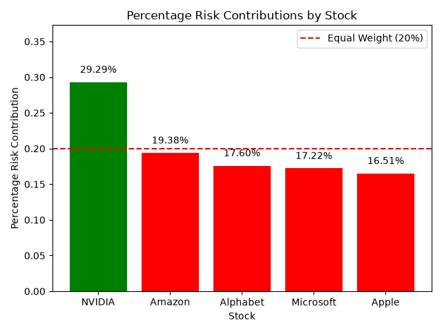

---

## 8. Rolling Portfolio Risk (`rolling_portfolio_risk.py`)

Calculates how portfolio risk changes through time by combining rolling covariance matrices with Modern Portfolio Theory to produce rolling portfolio variance and annualised rolling volatility.

Rather than treating portfolio risk as a single fixed value, this project recalculates the covariance matrix using a **60-trading-day rolling window**, allowing changes in market risk to be tracked across different market environments.

The analysis uses an equally weighted portfolio consisting of:

- Apple
- Microsoft
- Amazon
- Alphabet
- NVIDIA

Each stock is allocated an equal portfolio weight of **20%**.

### Features

- Downloads historical adjusted closing prices from Yahoo Finance
- Calculates daily percentage returns
- Computes rolling 60-day covariance matrices
- Annualises each rolling covariance matrix
- Calculates rolling portfolio variance
- Calculates rolling annualised portfolio volatility
- Identifies:
  - Current volatility
  - Average volatility
  - Maximum volatility
  - Minimum volatility
- Calculates equivalent variance statistics
- Automatically highlights the current, maximum and minimum portfolio volatility
- Annotates major historical market events
- Produces a rolling portfolio volatility chart

### Financial Interpretation

Portfolio risk changes over time.

During periods of market stress, individual stock volatility rises and correlations between stocks often increase at the same time, causing overall portfolio risk to increase. During calmer market conditions, volatility and covariance generally fall, reducing overall portfolio risk.

By recalculating the covariance matrix over every rolling window, this project demonstrates how portfolio risk evolves through time instead of assuming it remains constant.

### Example Output

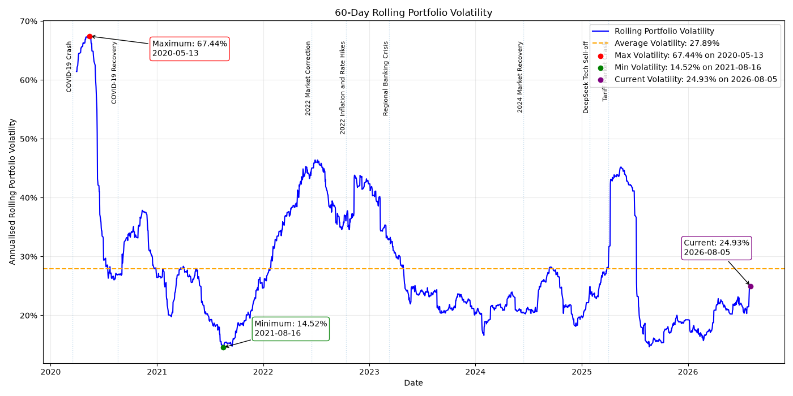

---

## 9. Rolling Portfolio Sharpe Ratio (`rolling_sharpe_ratio.py`)

Measures how the risk-adjusted performance of an equally weighted stock portfolio changes through time using a 60-trading-day rolling Sharpe Ratio.

Building on the rolling portfolio risk analysis from the previous project, this project combines rolling portfolio returns and rolling volatility with a time-varying risk-free rate. Rather than assuming a fixed risk-free rate, the 13-week U.S. Treasury bill yield is used as a historical proxy for the risk-free return.

The project also includes a separate rolling annualised return analysis. This provides a direct view of the portfolio's recent return behaviour and allows absolute performance to be compared with risk-adjusted performance.

The analysis uses an equally weighted portfolio consisting of:

- Apple
- Microsoft
- Amazon
- Alphabet
- NVIDIA

Each stock is allocated an equal portfolio weight of **20%**.

### Features

- Downloads historical adjusted closing prices from Yahoo Finance
- Calculates daily percentage returns
- Calculates equal-weight portfolio daily returns
- Downloads historical 13-week U.S. Treasury bill yield data (^IRX)
- Uses the Treasury yield as a time-varying proxy for the risk-free rate
- Aligns Treasury yields with portfolio trading dates
- Converts the annual Treasury yield into a daily risk-free rate
- Calculates daily portfolio excess returns
- Computes rolling 60-day covariance matrices
- Calculates annualised rolling portfolio variance and volatility
- Calculates 60-day rolling average portfolio returns
- Annualises the rolling portfolio return using 252 trading days
- Calculates 60-day rolling excess returns
- Calculates the annualised 60-day rolling Sharpe Ratio
- Validates portfolio volatility using an independent rolling standard deviation calculation
- Identifies:
  - Current Sharpe Ratio
  - Average Sharpe Ratio
  - Maximum Sharpe Ratio
  - Minimum Sharpe Ratio
  - Current 13-week Treasury yield
  - Current rolling annualised portfolio return
  - Average rolling annualised portfolio return
  - Maximum rolling annualised portfolio return
  - Minimum rolling annualised portfolio return
- Includes zero and average reference lines for the Sharpe Ratio
- Includes zero and average reference lines for rolling portfolio returns
- Automatically highlights the current, maximum and minimum Sharpe Ratios
- Automatically highlights the current, maximum and minimum rolling annualised returns
- Annotates major historical market events
- Compares rolling portfolio returns with the 13-week Treasury yield
- Produces a rolling Sharpe Ratio chart
- Produces a rolling annualised portfolio return chart

### Financial Interpretation

The Sharpe Ratio measures portfolio excess return relative to the amount of risk taken to generate that return.

A positive Sharpe Ratio indicates that the portfolio generated returns above the risk-free rate over the rolling period, while a negative Sharpe Ratio indicates that the portfolio underperformed the risk-free rate.

Unlike a single Sharpe Ratio calculated across the entire dataset, the rolling Sharpe Ratio shows how risk-adjusted performance changes through different market environments. This makes it possible to observe periods where strong returns justified the level of portfolio risk as well as periods where volatility increased without sufficient excess return.

Using the historical 13-week Treasury yield also allows changes in interest rates to affect the calculation. As the risk-free rate rises, the portfolio must generate a higher return to achieve the same Sharpe Ratio.

The separate rolling return analysis provides additional context by showing how the portfolio's annualised return estimate changes through time. Comparing the return and Sharpe Ratio figures demonstrates that the period with the highest return is not necessarily the period with the strongest risk-adjusted performance.

In the example analysis shown here, the maximum rolling annualised portfolio return occurred on **2020-06-10**, while the maximum rolling Sharpe Ratio occurred on **2025-07-17**. This shows that a period can generate exceptionally strong returns without necessarily providing the best return relative to the volatility taken.

### Rolling Annualised Portfolio Return

The rolling return figure shows the average daily portfolio return over the previous 60 trading days, annualised using 252 trading days.

The example analysis shown in the figure identified:

- Current rolling annualised return: **27.23%**
- Average rolling annualised return: **33.89%**
- Maximum rolling annualised return: **193.86%** on **2020-06-10**
- Minimum rolling annualised return: **-136.77%** on **2022-06-30**

The 13-week Treasury yield is also plotted on the same figure to provide context for the risk-free return available through time.

> **Note:** The rolling annualised return is not the actual return earned during the 60-day window. It represents the average daily return observed during that window annualised using 252 trading days. For example, the maximum value of 193.86% does not mean that the portfolio gained 193.86% during those 60 trading days.

### Validation

Rolling portfolio volatility is calculated from the portfolio covariance matrix using:

`Portfolio Variance = wᵀΣw`

The resulting volatility is independently checked against the rolling standard deviation of the portfolio's daily returns.

The difference between the two methods is approximately zero, providing a numerical cross-check that the covariance-based portfolio volatility calculation agrees with the volatility calculated directly from the portfolio return series.

### Example Output

#### 60-Day Rolling Portfolio Sharpe Ratio

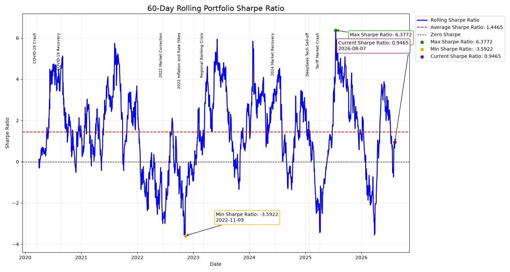

#### 60-Day Rolling Annualised Portfolio Return

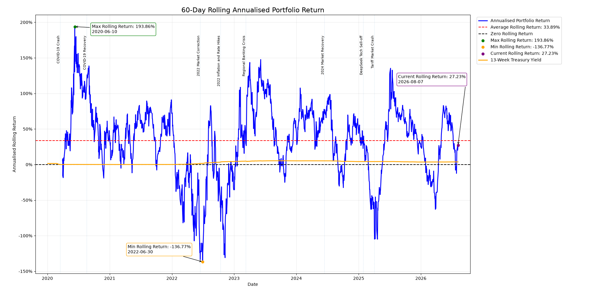

---

## 10. Monte Carlo Portfolio Weight Simulation (`monte_carlo_portfolio_simulation.py`)

Simulates 100,000 different portfolio allocations to explore the relationship between expected return, volatility and risk-adjusted performance across different combinations of the same five stocks.

Building on the portfolio return, covariance, volatility and Sharpe Ratio calculations from previous projects, this project removes the fixed 20% portfolio weights and allows the allocation to each stock to vary. Random long-only portfolio weights are generated using a Dirichlet distribution, with every simulated portfolio constrained to a total weight of 100%.

The analysis uses:

- Apple
- Amazon
- Alphabet
- Microsoft
- NVIDIA

### Features

- Downloads historical adjusted closing prices from Yahoo Finance
- Calculates daily percentage returns
- Calculates annualised historical mean returns for each stock as estimates of expected return
- Computes daily and annualised covariance matrices
- Downloads the 3-month U.S. Treasury constant maturity rate (DGS3MO) from FRED
- Uses the historical average 3-month Treasury rate as the annual risk-free rate proxy
- Simulates 100,000 different portfolio allocations
- Uses a fixed random seed for reproducible simulation results
- Generates long-only portfolio weights using a Dirichlet distribution
- Ensures each simulated portfolio's weights sum to 100%
- Calculates expected annual return for every simulated portfolio
- Calculates annualised volatility for every simulated portfolio
- Calculates the Sharpe Ratio for every simulated portfolio
- Identifies the portfolio with the maximum Sharpe Ratio
- Identifies the portfolio with the minimum volatility
- Calculates an equal-weight portfolio as a benchmark
- Compares return, volatility, Sharpe Ratio and individual stock weights across the three selected portfolios
- Independently recalculates the maximum Sharpe and minimum volatility portfolios to verify the selected results
- Produces a Monte Carlo risk-return scatter plot
- Uses the Sharpe Ratio as the colour scale across simulated portfolios
- Highlights the maximum Sharpe, minimum volatility and equal-weight portfolios

### Financial Interpretation

The simulation demonstrates how changing portfolio weights affects the trade-off between expected return and risk.

Each point on the chart represents a different allocation across the five stocks. Portfolios further to the right have higher expected volatility, while portfolios higher on the chart have higher expected annual returns. The colour of each portfolio represents its Sharpe Ratio, allowing risk-adjusted performance to be compared across the simulated allocations.

The maximum Sharpe Ratio portfolio represents the allocation with the highest risk-adjusted performance found among the 100,000 simulated portfolios. The minimum volatility portfolio represents the lowest-risk allocation found among those simulated portfolios.

The equal-weight portfolio provides a benchmark against the 100,000 randomly generated allocations and demonstrates how allowing portfolio weights to vary can produce different combinations of expected return, volatility and risk-adjusted performance.

The results also demonstrate the effect of diversification. Portfolio volatility depends not only on the volatility of the individual stocks, but also on their covariance with one another. Changing the allocation therefore changes both the expected return and the overall risk of the portfolio.

### Portfolio Weight Simulation

Portfolio weights are generated using a Dirichlet distribution. This produces long-only random allocations where every stock has a non-negative weight and the weights of each portfolio sum to 100%.

A fixed random seed is used so that the same 100,000 random portfolio weight allocations are generated each time the program is run. For unchanged input market data, this makes the simulation results reproducible and allows the calculated portfolios to be independently checked.

### Benchmark Portfolio

An equal-weight portfolio is calculated separately using a 20% allocation to each stock.

This provides a consistent benchmark against the simulated portfolios and allows the effect of changing portfolio allocations to be compared with the equal-weight approach used throughout several earlier projects.

### Validation

The maximum Sharpe Ratio and minimum volatility portfolios identified by the simulation are independently reconstructed using their selected portfolio weights.

Their expected returns, portfolio volatilities and Sharpe Ratios are then recalculated and compared with the values stored by the simulation.

The recalculated values match the original results, providing a numerical cross-check that the highlighted portfolios correspond to the correct simulated weight combinations.

### Example Output

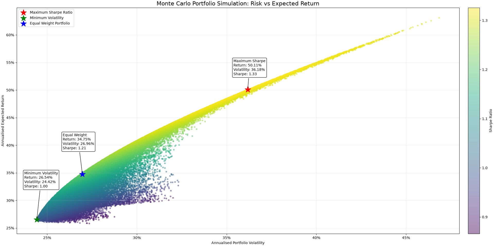

---

# Technologies Used

- Python
- Pandas
- Matplotlib
- Seaborn
- yfinance
- NumPy
- pandas-datareader

---

# Data Sources

- Yahoo Finance
- FRED

---

# Future Improvements

Some ideas I'd like to add as I continue learning:

- Efficient Frontier
- Portfolio Optimisation
- CAPM and Portfolio Beta
- Factor Models (Fama-French)
- Return and Risk Attribution
- Principal Component Analysis (PCA)
- Cointegration and Pairs Trading
- Options Fundamentals
- Binomial Option Pricing
- Black-Scholes Option Pricing
- Option Greeks
- Monte Carlo Option Pricing
- Implied Volatility and Volatility Surfaces

# Notes

This repository is mainly a learning project as I develop my Python skills alongside quantitative finance concepts.

The aim isn't to build production-ready software straight away, but to understand the statistics, mathematics and programming behind quantitative finance before gradually improving each project as I learn more.

Each project builds on ideas from previous ones, allowing me to revisit earlier work and improve it as my understanding develops.

---

## Repository Structure

```text
financial-data-analysis/
│
├── docs/                              # Project notes and future ideas
├── images/                            # Figures and dashboard demonstrations
│
├── single_stock_analysis.py
├── compare_stocks.py
├── portfolio_analysis.py
├── portfolio_rebalancing.py
├── correlation_matrix_currency.py
├── rolling_correlation_analysis.py
├── covariance_matrix_stocks.py
├── portfolio_variance.py
├── rolling_portfolio_risk.py
├── rolling_sharpe_ratio.py
├── monte_carlo_portfolio_simulation.py
│
├── requirements.txt
├── README.md
└── LICENSE

```

# Roadmap

- [x] Single Stock Analysis
- [x] Multi-Stock Comparison
- [x] Portfolio Analysis
- [x] Portfolio Rebalancing
- [x] Currency Correlation Matrix
- [x] Rolling Correlation Dashboard
- [x] Stock Covariance Matrix
- [x] Portfolio Variance and Risk Contribution
- [x] Rolling Portfolio Risk
- [x] Rolling Sharpe Ratio
- [x] Monte Carlo Portfolio Weight Simulation
- [ ] Efficient Frontier
- [ ] Portfolio Optimisation
- [ ] CAPM and Portfolio Beta
- [ ] Factor Models
- [ ] Return and Risk Attribution
- [ ] Principal Component Analysis
- [ ] Cointegration and Pairs Trading
- [ ] Options Fundamentals
- [ ] Binomial Option Pricing
- [ ] Black-Scholes Option Pricing
- [ ] Option Greeks
- [ ] Monte Carlo Option Pricing
- [ ] Implied Volatility and Volatility Surfaces